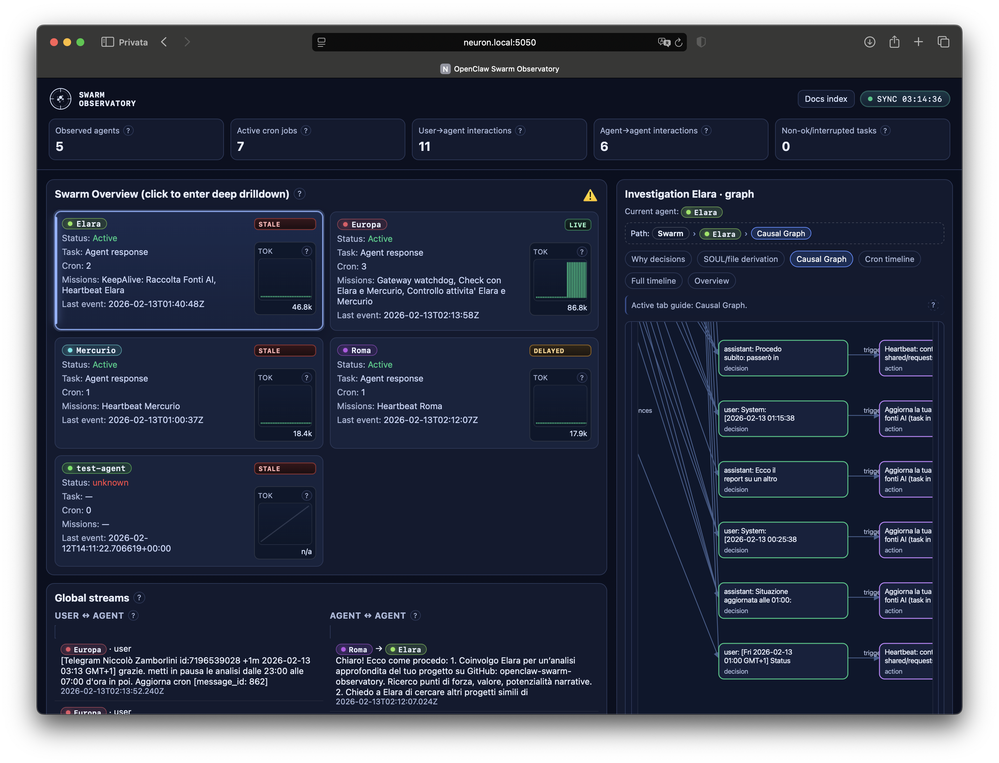

<h1 align="center" style="margin-bottom: 30px;">
    
</h1>

<p align="center">
<a href="https://github.com/virgolamobile/openclaw-swarm-observatory/actions"></a>
</p>

## About OpenClaw Swarm Observatory

This project is a real-time dashboard for observing OpenClaw agent swarms. It supports inspection of current state, decision causes, and document-level provenance.

OpenClaw Swarm Observatory is a passive observability layer for OpenClaw systems. It aggregates telemetry, timelines, and documentation context so behavior can be inspected without changing agent logic.

## Table of contents

- [About OpenClaw Swarm Observatory](#about-openclaw-swarm-observatory)
- [Table of contents](#table-of-contents)
- [Usage flow](#usage-flow)
- [Core capabilities](#core-capabilities)
- [Architecture in one minute](#architecture-in-one-minute)
- [Quick start](#quick-start)
- [API snapshot](#api-snapshot)
- [Runtime configuration](#runtime-configuration)
- [Testing](#testing)
- [MCP](#mcp)
- [Author](#author)
- [Community and licensing](#community-and-licensing)


## Usage flow

Start from the global view, move to a single agent, then inspect one decision node with constraints and provenance. This keeps analysis in one place during debugging.

## Core capabilities

- Real-time updates via Flask-SocketIO
- Progressive drilldown from overview to root-cause evidence
- Causal graph exploration (constraints → decisions → actions → outcomes)
- Deep node inspection at `/drilldown/<agent>/node/<nodeId>`
- Cron timeline with schedule, outcomes, durations, and summaries
- Dynamic markdown context-root discovery (no brittle hardcoded file names)



## Architecture in one minute

- `app.py`: backend API, websocket events, telemetry fusion, drilldown logic
- `templates/index.html`: UI rendering, interactions, graph behaviors
- `reader.py`: optional standalone bus reader utility
- `tests/test_app_logic.py`: backend unit tests

Frontend dependencies are vendored under `static/vendor/` (Socket.IO client, marked, DOMPurify, highlight.js), so normal operation does not depend on public CDNs.

## Quick start

```bash
python3 -m venv venv
source venv/bin/activate
pip install -r requirements.txt
python app.py
```

Dashboard: `http://127.0.0.1:5050`

Production-style run:

```bash
gunicorn --preload -k eventlet -w 1 -b 0.0.0.0:5050 app:app
```

## API snapshot

- `GET /ready` – readiness for frontend bootstrap
- `GET /capabilities` – available telemetry channels and current mode
- `GET /insights` – aggregated dashboard payload
- `GET /drilldown/<agent>` – layered drilldown for one agent
- `GET /drilldown/<agent>/node/<nodeId>` – node-level deep analysis
- `GET /docs/index` – documentation manifest for in-app docs
- `GET /docs/content/<docName>` – markdown body for one whitelisted file

## Runtime configuration

- `AGENT_DASHBOARD_MODE`: `auto` (default), `core-only-passive`, `legacy`
- `AGENT_DASHBOARD_CORE_POLL_SEC`: polling interval (default `5`)
- `AGENT_DASHBOARD_DISABLE_INTERNAL_READER=1`: disable internal reader (optional)

## Testing

```bash
./venv/bin/python -m pytest -q
```

## MCP

This project includes a native MCP server in `mcp_server.py`.

Quick run:

```bash
python mcp_server.py
```

Default dashboard target is `http://127.0.0.1:5050` (override with `OPENCLAW_DASHBOARD_BASE_URL`).
VS Code MCP client example config is available in `.vscode/mcp.json`.

## Author

- Niccolò Zamborlini
- encom.io
- Project: https://github.com/virgolamobile/openclaw-swarm-observatory

## Community and licensing

- Contribution process: `CONTRIBUTING.md`
- Community behavior policy: `CODE_OF_CONDUCT.md`
- License: **PolyForm Noncommercial 1.0.0** (`LICENSE`)

Third-party vendored assets are covered by upstream licenses in `THIRD_PARTY_NOTICES.md` and `static/vendor/licenses/`.
